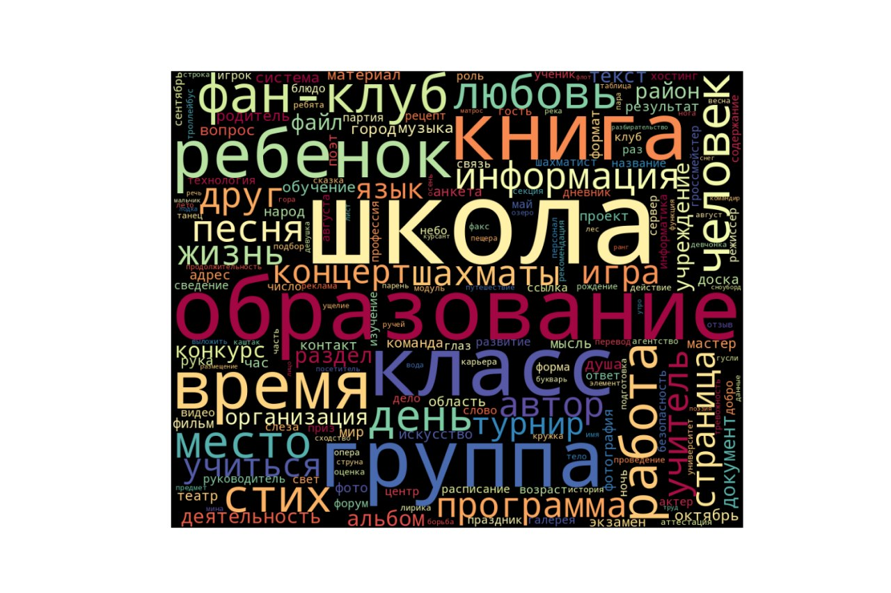
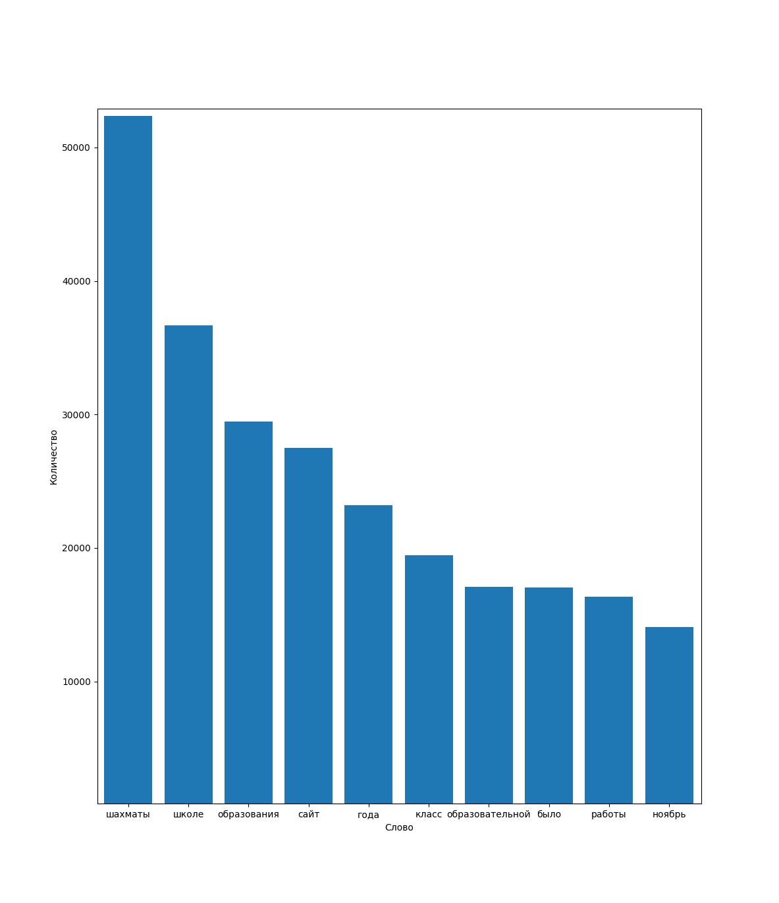
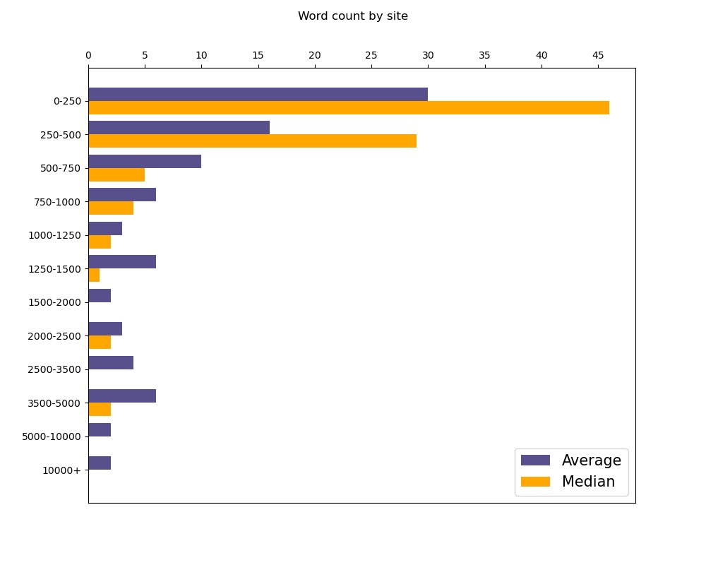
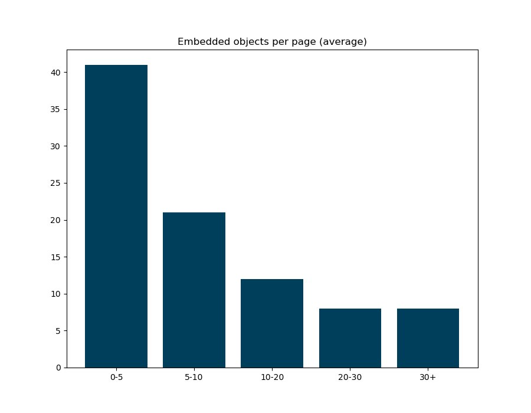
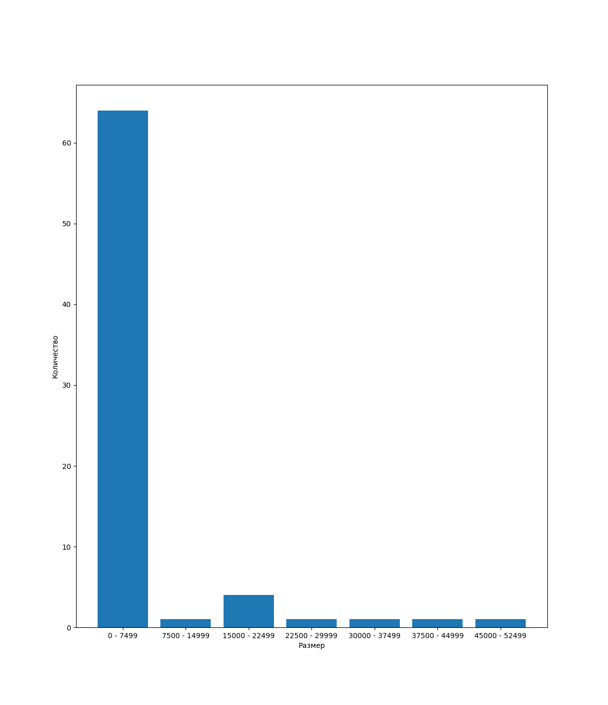
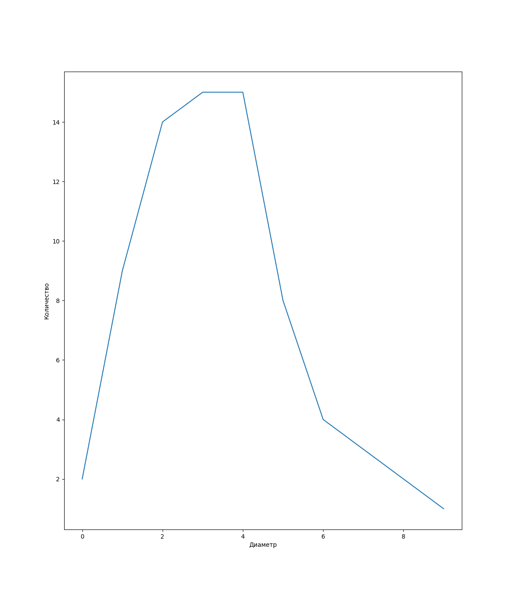

# Второй репозиторий проекта "Дата-археология"

## Описание

В этом репозитории содержится часть отвечающая за сбор
статистики и ее визуализацию. Эта часть разрабатывалась
Мной(Иваном) и Софьей

## Фото диаграм

